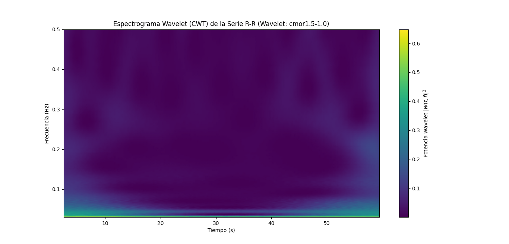
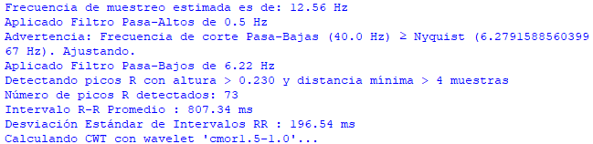

# Variabilidad de la Frecuencia Cardiaca usando la Transformada Wavelet 

## Descripción
Con el objetivo de analizar las fluctuaciones en la frecuencia cardíaca (HRV) mediante herramientas del procesamiento digital de señales,  se realizó un experimento  práctico para adquirir una señal ECG de un paciente en reposo, posterior se filtró digitalmente y se extrageron los intervalos R-R, para luego calcular parámetros estadísticos en el dominio del tiempo, por último, se aplicó la transformada wavelet para generar un espectrograma que permitió visualizar la evolución de las componentes de baja y alta frecuencia de la HRV a lo largo del tiempo. Este análisis busca establecer relaciones entre la dinámica de la señal cardíaca y la actividad simpática o parasimpática del sistema nervioso autónomo.

## Desarrollo
### a) Fundamento Teórico
1. Actividad simpática y parasimpática del sistema nervioso autónomo 
El sistema nervioso autónomo (SNA) regula funciones involuntarias como la frecuencia cardíaca, la digestión y la respiración. Se divide en:   
- Sistema simpático:   
  - Activado en situaciones de estrés o alerta ("lucha o huida").   
  - Aumenta la frecuencia cardíaca, dilata las pupilas y reduce la digestión.   
  - Libera noradrenalina y adrenalina.   
- Sistema parasimpático:   
  - Dominante en estados de reposo ("descanso y digestión").   
  - Disminuye la frecuencia cardíaca, estimula la digestión y contrae las pupilas.   
  - Libera acetilcolina.   

El balance entre ambos sistemas influye en la variabilidad de la frecuencia cardíaca (HRV), medida a través de los intervalos R-R en el ECG.   

2. Efecto de la actividad simpática y parasimpática en la frecuencia cardíaca 
- Activación simpática:   
  - Aumenta la frecuencia cardíaca (taquicardia).   
  - Reduce la HRV (los latidos son más regulares bajo estrés).   
- Activación parasimpática:   
  - Disminuye la frecuencia cardíaca (bradicardia).   
  - Aumenta la HRV (mayor variabilidad en reposo).   
Ejemplo:   
- Durante el ejercicio → Predomina el sistema simpático → ↑ Frecuencia cardíaca. 
- En reposo → Predomina el parasimpático → ↓ Frecuencia cardíaca pero ↑ HRV.   

3. Variabilidad de la Frecuencia Cardíaca (HRV) y análisis del intervalo R-R 
La HRV es una medida de las variaciones en los intervalos de tiempo entre latidos consecutivos (R-R en el ECG),es un indicador no invasivo del estado del sistema nervioso autónomo. 
Frecuencias de interés: 
Baja frecuencia (0.04–0.15 Hz): mezcla de actividad simpática y parasimpática. 
Alta frecuencia (0.15–0.4 Hz): refleja principalmente actividad parasimpática. 
Métodos de análisis:   
- Dominio del tiempo: Desviación estándar de los intervalos R-R (SDNN).   
- Dominio de la frecuencia: Transformada de Fourier o Wavelet para descomponer la señal.   
4. Transformada Wavelet: Definición y aplicación en señales biológicas**   
La transformada wavelet es una herramienta matemática para analizar señales no estacionarias (como el ECG).   
- Ventajas sobre la transformada de Fourier:   
  - Proporciona resolución temporal y frecuencial simultánea.   
  - Ideal para analizar HRV, donde la frecuencia varía con el tiempo.   
- Wavelets comunes en biofisica:   
  - Morlet: Buena resolución en frecuencia.   
  - Daubechies (db4/db6): Usada en procesamiento de ECG.   
  - Haar: Simple, útil para detección de picos R.   
Aplicación en HRV:   
- Permite analizar cómo cambian las componentes de baja frecuencia y alta frecuencia a lo largo del tiempo.   
- Detecta transiciones entre estados simpático/parasimpático.   
5. Diagrama de Flujo del Experimento  

Figura 1. Diagrama de flujo del proceso del laboratorio.

### b) Adquisición de la señal ECG 
Para la adquisición de la señal electrocardiográfica se hizo uso del modulo AD8232 ya que viene con filtros electronicos incorporados facilitando en mayor medida la adquisición de la señal, se usaron también sus resopectivos electrodos y cables de JAC además del microcontrolador "DAQ" en donde se capturan en reposo por cinco minutos y luego se visualizan primeramente la señal análoga obtenida para ya posteriormente se guardarse en un excel el cuál tiene como nombre "ECG_8.csv" y se encuentra en el repositorio. 
En la figura 2 a continuación se muestra la señal electrocardiografica obtenida por medio de la siguiente linea de codigo de python.

    file_path = "DATA_ECG\ECG_6.csv"
    df = pd.read_csv(file_path)
    tiempo = df.iloc[:, 0].values
    voltaje = df.iloc[:, 1].values
    
    fs_estimates = 1 / np.diff(tiempo)
    fs_mean = np.nanmedian(fs_estimates)
    print(f"Frecuencia de muestreo estimada es de: {fs_mean:.2f} Hz")
    
    fs = fs_mean
    
    # Señal original
    plt.figure(figsize=(15, 4))
    plt.plot(tiempo, voltaje, label="Señal ECG Original", color="r")
    plt.xlabel("Tiempo (s)")
    plt.ylabel("Voltaje (v) ")
    plt.title("Señal ECG Original")
    plt.legend()
    plt.grid(True)
    plt.show()

Figura 2. Señal del electrocardiograma.

### c) Pre-procesamiento de la señal 
Una vez obtenida la señal y gráficada, se procede a aplicar filtros digitales a la señal, especificamente los filtro IIR con respuesta butterworth debido a su respuesta contante en banda pasante. Normalmente la señal electrocardiografica se puede ver afectada por ruidos de baja frecuencia (siendo producidas por movimientos o respiración a la toma de la señal) por debajo de los 0.5 Hz y ruidos de alta frecuencia (siendo producidas por cosas como la interferencia eléctrica y los EMG cerca a la zona) por encima de 40 Hz; por lo tanto se implementa un pasa altos con frecuencia de corte en los 0.5Hz y un pasa bajos con frecuencia de corte en los 40Hz. Estos filtros son de orden 5 y son aplicados normalizados por medio de las funciones de python "butter()" y "filtfilt()" como se muestra en las lineas de codigo a continuación. 

    nyquist = 0.5 * fs
    order = 5
    
    lowcut = 0.5
    if lowcut >= nyquist:
        print(f"Advertencia: Frecuencia de corte Pasa-Altos ({lowcut} Hz) ≥ Nyquist ({nyquist} Hz).")
        ecg_filtered_hp = voltaje
    else:
        low = lowcut / nyquist
        b_hp, a_hp = butter(order, low, btype='highpass')
        ecg_filtered_hp = filtfilt(b_hp, a_hp, voltaje)
        print(f"Aplicado Filtro Pasa-Altos de {lowcut} Hz")
    
    highcut = 40.0
    if highcut >= nyquist:
        print(f"Advertencia: Frecuencia de corte Pasa-Bajas ({highcut} Hz) ≥ Nyquist ({nyquist} Hz). Ajustando.")
        highcut = nyquist * 0.99
    
    high = highcut / nyquist
    b_lp, a_lp = butter(order, high, btype='lowpass')
    ecg_filtered = filtfilt(b_lp, a_lp, ecg_filtered_hp)
    print(f"Aplicado Filtro Pasa-Bajos de {highcut:.2f} Hz")

Adicionalmente, se gráfica la señal filtrada en la figura 3 por medio de las siguiente lineas de codigo.

    plt.figure(figsize=(15, 4))
    plt.plot(tiempo, ecg_filtered, label="Señal ECG Filtrada", color="g")
    plt.xlabel("Tiempo (s)")
    plt.ylabel("Voltaje (V)")
    plt.title("Señal ECG Filtrada")
    plt.legend()
    plt.grid(True)
    plt.show()

Figura 3. Señal del ECG filtrada por medio de los filtros IIR

Para poder identificar los picos R los cuales representan los máximos de la despolarización ventricular y son importantes para los calculos del ritmo cardiaco y los intervalos R-R, se hace principalmente por la función "find_peaks()" y se vizualiza por la función "plot()" como se muestra en las siguientes lineas del código junto con la figura 4 con el ECG y sus respectivos picos.

    min_hr_bpm = 40
    max_hr_bpm = 180
    min_distance_sec = 60.0 / max_hr_bpm
    min_distance_samples = int(min_distance_sec * fs)
    if min_distance_samples < 1:
        min_distance_samples = 1
    
    peak_height_threshold = np.mean(ecg_filtered) + 0.6 * np.std(ecg_filtered)
    if peak_height_threshold < np.percentile(ecg_filtered, 75):
        peak_height_threshold = np.percentile(ecg_filtered, 75)
    
    print(f"Detectando picos R con altura > {peak_height_threshold:.3f} y distancia mínima > {min_distance_samples} muestras")
    
    peaks_indices, properties = find_peaks(ecg_filtered, height=peak_height_threshold, distance=min_distance_samples)
    print(f"Número de picos R detectados: {len(peaks_indices)}")
    
    plt.figure(figsize=(15, 4))
    plt.plot(tiempo, ecg_filtered, label='ECG Filtrada')
    plt.plot(tiempo[peaks_indices], ecg_filtered[peaks_indices], 'ro', label='Picos R Detectados')
    plt.title('Detección de Picos R')
    plt.xlabel('Tiempo (s)')
    plt.ylabel('Voltaje (V)')
    plt.legend()
    plt.grid(True)
    plt.show()

Figura 4. Señal ECG con los picos detectados

Posteriormente, se realizan los intervalos RR y se hacen conversiones de estos picos a tiempo para calcular los tiempos de dichos intervalos para poder llegar a una conclusión de ritmos cardiacos. Esto se hace por medio de las siguientes lineas de codigo y su grafica resultante es mostrada en la figura 5.

    if len(peaks_indices) > 1:
        rr_intervals_samples = np.diff(peaks_indices)
        rr_intervals_sec = rr_intervals_samples / fs
        rr_times_sec = tiempo[peaks_indices[1:]]
    
        if len(rr_intervals_sec) > 1:
            plt.figure(figsize=(12, 5))
            plt.plot(rr_times_sec, rr_intervals_sec * 1000, marker='o', linestyle='-', label='Intervalos R-R')
            plt.title('Serie de Intervalos R-R ')
            plt.xlabel('Tiempo (s)')
            plt.ylabel('Intervalo R-R (ms)')
            plt.grid(True)
            plt.show()
    

Figura 5. Resultado del trazado de los intervalos R-R

### d) Análisis de la HRV en el dominio del tiempo 
Puesto que ya se tienen los valores de los intervalos R-R en tiempo, se procede a hacer cálculos básicos de la media o promedio y la desviación estándar de estas por medio de las funciones "mean()" y "std()".

        mean_rr = np.mean(rr_intervals_sec)
        sdnn = np.std(rr_intervals_sec)
    
        print(f"Intervalo R-R Promedio : {mean_rr * 1000:.2f} ms")
        print(f"Desviación Estándar de Intervalos RR : {sdnn * 1000:.2f} ms")

        //Resultados de dichos calculos en el command window
        Intervalo R-R Promedio : 807.34 ms
        Desviación Estándar de Intervalos RR : 196.54 ms

### e) Aplicación de transformada Wavelet
Una wavelet es una función matemática que tiene duración finita, es oscilatoria y se localiza tanto en el tiempo como en la frecuencia; cabe recalcar que a diferencia del seno/coseno de la transformada de Fourier, la wavelet se "apaga" fuera de una región breve, de esta manera es útil para detectar cambios transitorios.

     time_uniform = np.arange(rr_times_sec[0], rr_times_sec[-1], 1/target_fs_rr)
     rr_interpolated = np.interp(time_uniform, rr_times_sec, rr_intervals_sec)

Con el anterior fragmento de código damos inicio al último ítem del laboratorio, con este se genera una serie de tiempos con una frecuencia deseada, interpolando de esta manera la señal que nos interesa, es decir los intervalos R-R a un nuevo tiempo con la función "rr_interpolated", cumpliendo así la característica de la transformada wavelet, la cual es que la señal es muestreada uniformemente. 

     wavelet_name = 'cmor1.5-1.0'
     min_freq = 0.03
     max_freq = 0.5
     total_scales = 128
En la transformada wavelet, la escala es un parámetro que controla cuánto se estira o comprime la wavelet madre para analizar la señal. Una escala pequeña corresponde a una wavelet comprimida, sensible a frecuencias altas, mientras que una escala grande corresponde a una wavelet estirada, sensible a frecuencias bajas (variaciones lentas). La relación entre escala y frecuencia depende del tipo de wavelet utilizada y se puede calcular mediante la función scale2frequency de PyWavelets, que asocia cada escala a su frecuencia efectiva. 

La función "min_freq" y "maz_freq" destaca el rango de frecuencias que se desea analizar, determinando luego el número de escalas que se desea interpretar, teniendo en cuenta que a mayor número de escalas, mejor resolución de la frecuencia. 
     scales = np.geomspace(
         pywt.scale2frequency(wavelet_name, 1) / max_freq,
         pywt.scale2frequency(wavelet_name, 1) / min_freq,
         num=total_scales
     ) * target_fs_rr
Se usa la función "pywt.scale2frequency() para convertir frecuencias a escalas wavelet que fueron explicadas anteiormente, por su parte "np.geomspace" genera una secuencia logarítmica de escalas entre las asociadas a max_freq y min_freq.

     power = np.abs(coefficients)**2
     plt.pcolormesh(time_uniform, frequencies, power, shading='gouraud', 
     cmap='viridis')
Por último, se realizó el cálculo de de la señal en cada instante y frecuencia, implementando ∣𝑊(𝑡,𝑓)∣2, generando de esta manera una gráfica que evalúa el tiempo vs la frecuencia representando así la potencia en el espectrograma mostrado a continuación. 

 El espectrograma obtenido permite visualizar la distribución de potencia en las bandas de la frecuencia baja y la frecuencia alta, muestra patrones dinámicos que permiten identificar periodos de mayor o menor variabilidad cardiaca, cambios en el equilibrio autonómico, o eventos fisiológicos como estrés o relajación. Así, este enfoque ofrece una herramienta.
 
## Instrucciones
1) En primer lugar descargar o copiar y pegar el código de Python subido en este repositorio, el cuál esta guardado como "lab5.py", en el compilador que desee. Cabe recalcar que debe asegurarse que se encuentren las librerias enlistadas en los requerimientos para que pueda compilarse adecuadamente el programa y muestre tanto las gráficas deseadas como los resultados de los cálculos. En el caso de querer tomar su propio electrocardiograma, tomar los datos de la manera que se describió en el desarrollo y guardar los respectivos datos en un excel y cambiar el nombre en el "file_path".

2) Descargar los archivos que contienen los datos de la señal electromiográfica incluidos también en el presente repositorio con el nombre de “ECG_6.csv”. Se aconseja que se guarden los archivos de este inciso y el anterior en la misma carpeta para su fácil acceso y compilación.

3) Correr el programa, esperar a que se compile por completo y si todo está en orden, se verán los resultados en el terminal de comandos de la manera que se muestra en la siguiente figura y las respectivas gráficas, las cuales se abriran de manera progresiva.

## Requerimientos
- Python 3.11.
- Librerias como: wfdb, matplotlib, numpy, scipy.signal, pywt, pandas.
- Modulo ECG con sus electrodos y cables JAC.
- Microcontrolador DAQ.
## Referencias

## AUTORES
- Juan Diego Clavijo Fuentes
  est.juan.dclavijjo@unimilitar.edu.co
- Sofia Olivella Moreno
  est.sofia.olivella@unimilitar.edu.co
