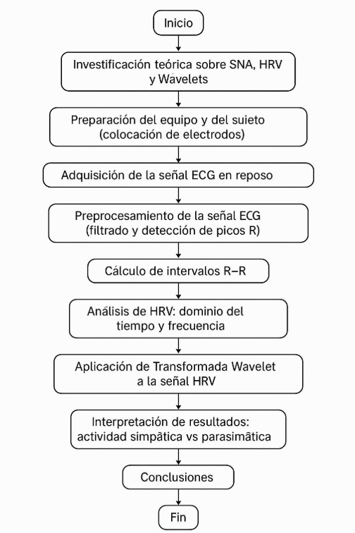
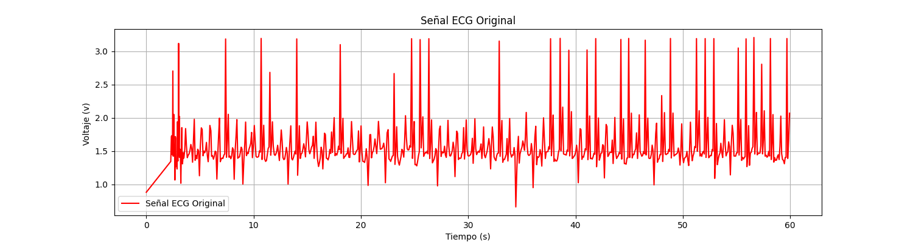
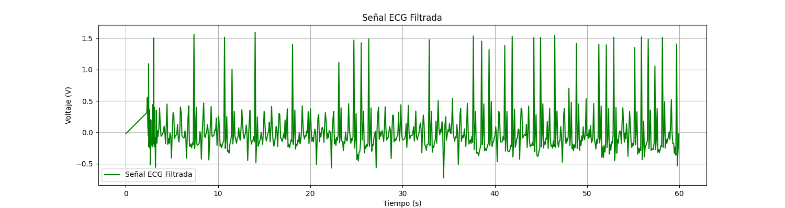
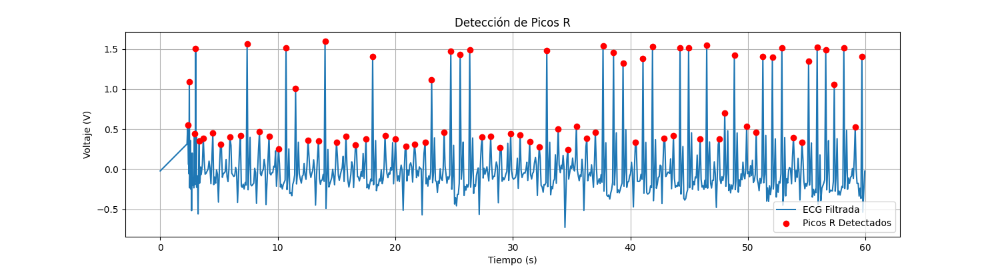
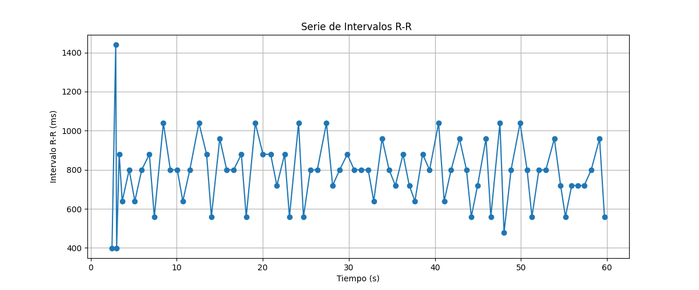
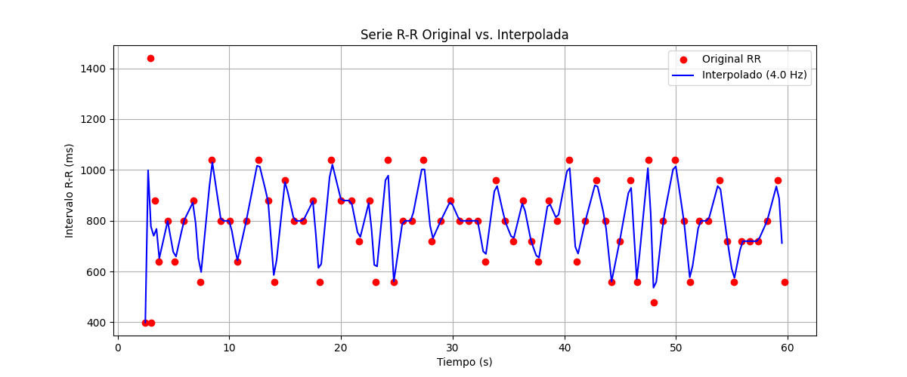

# Variabilidad de la Frecuencia Cardiaca usando la Transformada Wavelet 

## Descripción

## Desarrollo
### a) Fundamento Teórico
1. Actividad simpática y parasimpática del sistema nervioso autónomo 
El sistema nervioso autónomo (SNA) regula funciones involuntarias como la frecuencia cardíaca, la digestión y la respiración. Se divide en:   
- Sistema simpático:   
  - Activado en situaciones de estrés o alerta ("lucha o huida").   
  - Aumenta la frecuencia cardíaca, dilata las pupilas y reduce la digestión.   
  - Libera noradrenalina y adrenalina.   
- Sistema parasimpático:   
  - Dominante en estados de reposo ("descanso y digestión").   
  - Disminuye la frecuencia cardíaca, estimula la digestión y contrae las pupilas.   
  - Libera acetilcolina.   

El balance entre ambos sistemas influye en la variabilidad de la frecuencia cardíaca (HRV), medida a través de los intervalos R-R en el ECG.   

2. Efecto de la actividad simpática y parasimpática en la frecuencia cardíaca 
- Activación simpática:   
  - Aumenta la frecuencia cardíaca (taquicardia).   
  - Reduce la HRV (los latidos son más regulares bajo estrés).   
- Activación parasimpática:   
  - Disminuye la frecuencia cardíaca (bradicardia).   
  - Aumenta la HRV (mayor variabilidad en reposo).   
Ejemplo:   
- Durante el ejercicio → Predomina el sistema simpático → ↑ Frecuencia cardíaca. 
- En reposo → Predomina el parasimpático → ↓ Frecuencia cardíaca pero ↑ HRV.   

3. Variabilidad de la Frecuencia Cardíaca (HRV) y análisis del intervalo R-R 
La HRV es una medida de las variaciones en los intervalos de tiempo entre latidos consecutivos (R-R en el ECG),es un indicador no invasivo del estado del sistema nervioso autónomo. 
Frecuencias de interés: 
Baja frecuencia (0.04–0.15 Hz): mezcla de actividad simpática y parasimpática. 
Alta frecuencia (0.15–0.4 Hz): refleja principalmente actividad parasimpática. 
Métodos de análisis:   
- Dominio del tiempo: Desviación estándar de los intervalos R-R (SDNN).   
- Dominio de la frecuencia: Transformada de Fourier o Wavelet para descomponer la señal.   
4. Transformada Wavelet: Definición y aplicación en señales biológicas**   
La transformada wavelet es una herramienta matemática para analizar señales no estacionarias (como el ECG).   
- Ventajas sobre la transformada de Fourier:   
  - Proporciona resolución temporal y frecuencial simultánea.   
  - Ideal para analizar HRV, donde la frecuencia varía con el tiempo.   
- Wavelets comunes en biofisica:   
  - Morlet: Buena resolución en frecuencia.   
  - Daubechies (db4/db6): Usada en procesamiento de ECG.   
  - Haar: Simple, útil para detección de picos R.   
Aplicación en HRV:   
- Permite analizar cómo cambian las componentes de baja frecuencia y alta frecuencia a lo largo del tiempo.   
- Detecta transiciones entre estados simpático/parasimpático.   
5. Diagrama de Flujo del Experimento  

Figura 1. Diagrama de flujo del proceso del laboratorio.

### b) Adquisición de la señal ECG 
Para la adquisición de la señal electrocardiográfica se hizo uso del modulo AD8232 ya que viene con filtros electronicos incorporados facilitando en mayor medida la adquisición de la señal, se usaron también sus resopectivos electrodos y cables de JAC además del microcontrolador "DAQ" en donde se capturan en reposo por cinco minutos y luego se visualizan primeramente la señal análoga obtenida para ya posteriormente se guardarse en un excel el cuál tiene como nombre "ECG_8.csv" y se encuentra en el repositorio. 
En la figura 2 a continuación se muestra la señal electrocardiografica obtenida por medio de la siguiente linea de codigo de python.

    file_path = "DATA_ECG\ECG_6.csv"
    df = pd.read_csv(file_path)
    tiempo = df.iloc[:, 0].values
    voltaje = df.iloc[:, 1].values
    
    fs_estimates = 1 / np.diff(tiempo)
    fs_mean = np.nanmedian(fs_estimates)
    print(f"Frecuencia de muestreo estimada es de: {fs_mean:.2f} Hz")
    
    fs = fs_mean
    
    # Señal original
    plt.figure(figsize=(15, 4))
    plt.plot(tiempo, voltaje, label="Señal ECG Original", color="r")
    plt.xlabel("Tiempo (s)")
    plt.ylabel("Voltaje (v) ")
    plt.title("Señal ECG Original")
    plt.legend()
    plt.grid(True)
    plt.show()

Figura 2. Señal del electrocardiograma.

### c) Pre-procesamiento de la señal 
Una vez obtenida la señal y gráficada, se procede a aplicar filtros digitales a la señal, especificamente los filtro IIR con respuesta butterworth debido a su respuesta contante en banda pasante. Normalmente la señal electrocardiografica se puede ver afectada por ruidos de baja frecuencia (siendo producidas por movimientos o respiración a la toma de la señal) por debajo de los 0.5 Hz y ruidos de alta frecuencia (siendo producidas por cosas como la interferencia eléctrica y los EMG cerca a la zona) por encima de 40 Hz; por lo tanto se implementa un pasa altos con frecuencia de corte en los 0.5Hz y un pasa bajos con frecuencia de corte en los 40Hz. Estos filtros son de orden 5 y son aplicados normalizados por medio de las funciones de python "butter()" y "filtfilt()" como se muestra en las lineas de codigo a continuación. 

    nyquist = 0.5 * fs
    order = 5
    
    lowcut = 0.5
    if lowcut >= nyquist:
        print(f"Advertencia: Frecuencia de corte Pasa-Altos ({lowcut} Hz) ≥ Nyquist ({nyquist} Hz).")
        ecg_filtered_hp = voltaje
    else:
        low = lowcut / nyquist
        b_hp, a_hp = butter(order, low, btype='highpass')
        ecg_filtered_hp = filtfilt(b_hp, a_hp, voltaje)
        print(f"Aplicado Filtro Pasa-Altos de {lowcut} Hz")
    
    highcut = 40.0
    if highcut >= nyquist:
        print(f"Advertencia: Frecuencia de corte Pasa-Bajas ({highcut} Hz) ≥ Nyquist ({nyquist} Hz). Ajustando.")
        highcut = nyquist * 0.99
    
    high = highcut / nyquist
    b_lp, a_lp = butter(order, high, btype='lowpass')
    ecg_filtered = filtfilt(b_lp, a_lp, ecg_filtered_hp)
    print(f"Aplicado Filtro Pasa-Bajos de {highcut:.2f} Hz")

Adicionalmente, se gráfica la señal filtrada en la figura 3 por medio de las siguiente lineas de codigo.

    plt.figure(figsize=(15, 4))
    plt.plot(tiempo, ecg_filtered, label="Señal ECG Filtrada", color="g")
    plt.xlabel("Tiempo (s)")
    plt.ylabel("Voltaje (V)")
    plt.title("Señal ECG Filtrada")
    plt.legend()
    plt.grid(True)
    plt.show()

Figura 3. Señal del ECG filtrada por medio de los filtros IIR

### d) Análisis de la HRV en el dominio del tiempo 
### e) Aplicación de transformada Wavelet

## Instrucciones

## Requerimientos

## Referencias

## AUTORES
- Juan Diego Clavijo Fuentes
  est.juan.dclavijjo@unimilitar.edu.co
- Sofia Olivella Moreno
  est.sofia.olivella@unimilitar.edu.co
